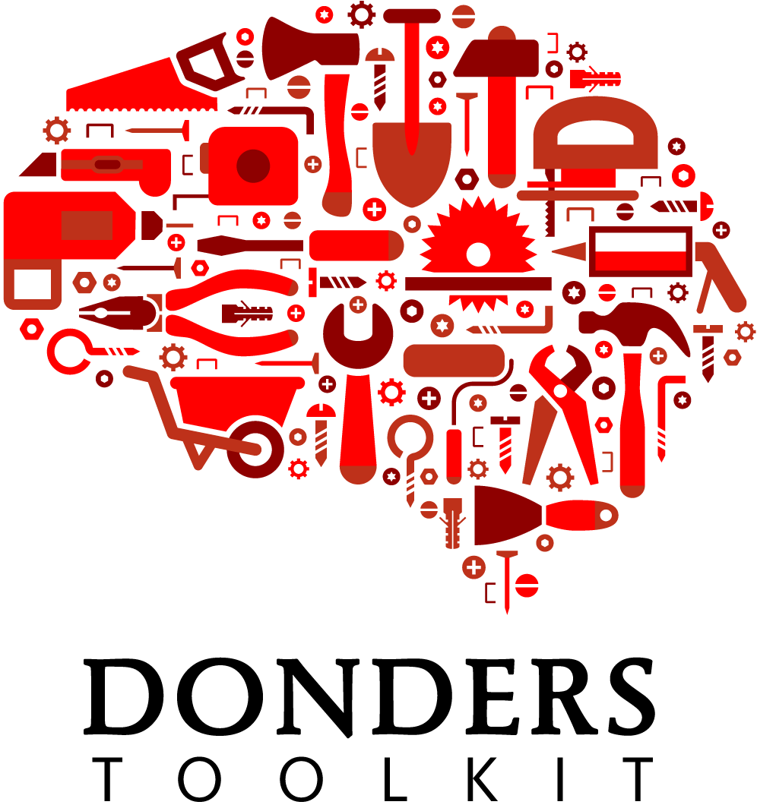

# Donders Non-Invasive Brain Stimulation Toolkit database
This repository serves to host the website of the Donders non-invasive brain stimulation toolkit database. The goal of this site is to make videos and documentation of various non-invasive brain stimulation methods freely and easily accessible for aspiring users.